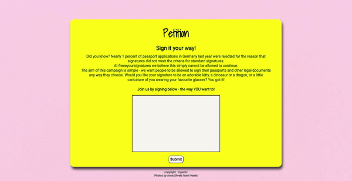

# petition
 
An online petition project where people can sign for the given cause. 
User can update his profile, providing information about his age, current city and url. 
The profile information can be changed later if the user desires. After the petition is signed,
user may see the list of all the signers together or divided by the city of origin. 
The page also provides an option to delete ones signature. 
 
 

 
 
###Development 
Javascript 
Node.js 
Express.js 
Express Handlebars 
Postgresql 
CSS 
HTML 
